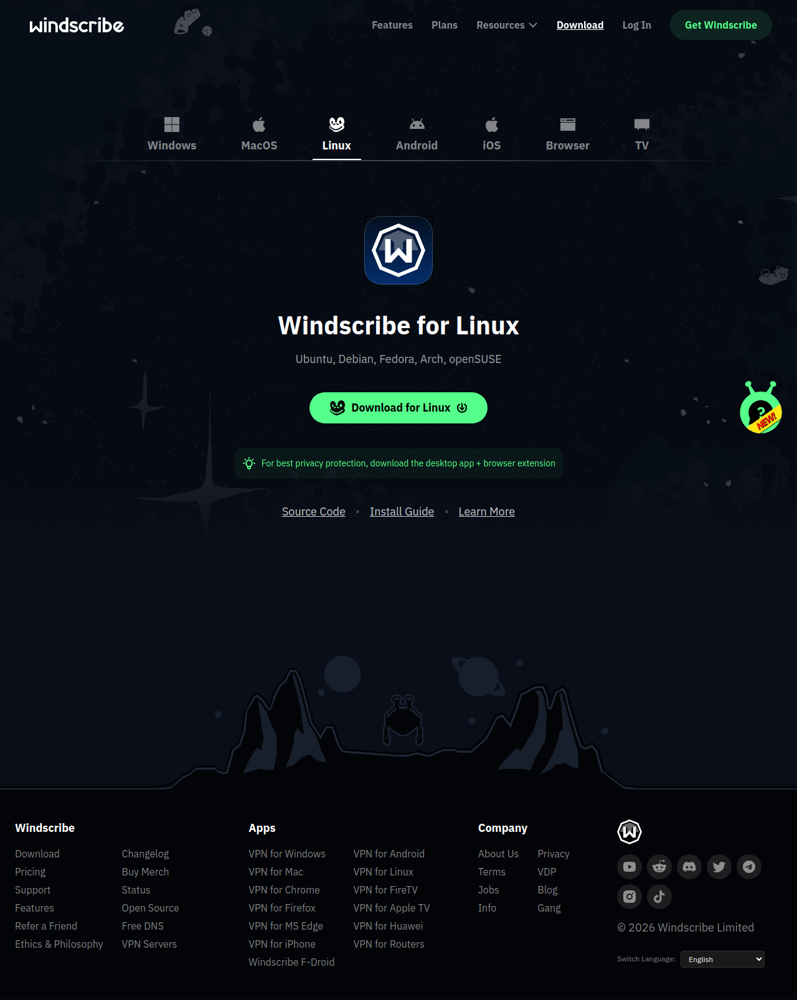

# Visited: https://windscribe.com/download

**Time:** 2026-05-28 22:00:33 UTC

## Favicon

## Screenshot

## Raw HTML
[page.html](./page.html)

## Downloaded Media (15 files)

- [0963201_favicon.ico](./media/0963201_favicon.ico) (15 KB)

## Other Links
- [/](/)
- [/_next/static/chunks/2791-862017970fa42b68.js](/_next/static/chunks/2791-862017970fa42b68.js)
- [/_next/static/chunks/4166-e16f922ba5119500.js](/_next/static/chunks/4166-e16f922ba5119500.js)
- [/_next/static/chunks/4bd1b696-9909f507f95988b8.js](/_next/static/chunks/4bd1b696-9909f507f95988b8.js)
- [/_next/static/chunks/5542-e098002876fda8dc.js](/_next/static/chunks/5542-e098002876fda8dc.js)
- [/_next/static/chunks/5964-0458477a94e4793b.js](/_next/static/chunks/5964-0458477a94e4793b.js)
- [/_next/static/chunks/6766-c2de1a23dce539d1.js](/_next/static/chunks/6766-c2de1a23dce539d1.js)
- [/_next/static/chunks/6833-4e1e585de4c83a0c.js](/_next/static/chunks/6833-4e1e585de4c83a0c.js)
- [/_next/static/chunks/6874-414075bb21e16c80.js](/_next/static/chunks/6874-414075bb21e16c80.js)
- [/_next/static/chunks/7544-606dc1d602d6a561.js](/_next/static/chunks/7544-606dc1d602d6a561.js)
- [/_next/static/chunks/9081-ea2554e163f2c56b.js](/_next/static/chunks/9081-ea2554e163f2c56b.js)
- [/_next/static/chunks/9824-635f4685e2217fd1.js](/_next/static/chunks/9824-635f4685e2217fd1.js)
- [/_next/static/chunks/app/%5Blocale%5D/download/page-8810f5d869bf93ff.js](/_next/static/chunks/app/%5Blocale%5D/download/page-8810f5d869bf93ff.js)
- [/_next/static/chunks/app/%5Blocale%5D/layout-dc7d90a079f40613.js](/_next/static/chunks/app/%5Blocale%5D/layout-dc7d90a079f40613.js)
- [/_next/static/chunks/app/%5Blocale%5D/not-found-d96cd69e64238ec2.js](/_next/static/chunks/app/%5Blocale%5D/not-found-d96cd69e64238ec2.js)
- [/_next/static/chunks/app/not-found-5c1cef77765ebb87.js](/_next/static/chunks/app/not-found-5c1cef77765ebb87.js)
- [/_next/static/chunks/c16f53c3-512863807ac4aa7a.js](/_next/static/chunks/c16f53c3-512863807ac4aa7a.js)
- [/_next/static/chunks/main-app-2aa671041fe6f622.js](/_next/static/chunks/main-app-2aa671041fe6f622.js)
- [/_next/static/chunks/polyfills-42372ed130431b0a.js](/_next/static/chunks/polyfills-42372ed130431b0a.js)
- [/_next/static/chunks/webpack-4b749a1d1a4da0d5.js](/_next/static/chunks/webpack-4b749a1d1a4da0d5.js)
- [/_next/static/css/3c1c6b875c38ba81.css](/_next/static/css/3c1c6b875c38ba81.css)
- [/_next/static/css/9d8f8bbaae442393.css](/_next/static/css/9d8f8bbaae442393.css)
- [/_next/static/css/a747632e354ce83c.css](/_next/static/css/a747632e354ce83c.css)
- [/_next/static/css/c5a2a2262e28ba8e.css](/_next/static/css/c5a2a2262e28ba8e.css)
- [/_next/static/css/e89fba0dfb9ef15e.css](/_next/static/css/e89fba0dfb9ef15e.css)
- [/_next/static/css/e9b63b6ba6e16bb1.css](/_next/static/css/e9b63b6ba6e16bb1.css)
- [/_next/static/css/fd7be38b0651d67b.css](/_next/static/css/fd7be38b0651d67b.css)
- [/_next/static/media/24f44be2cf98e6f7-s.p.woff2](/_next/static/media/24f44be2cf98e6f7-s.p.woff2)
- [/_next/static/media/26d4368bf94c0ec4-s.p.woff2](/_next/static/media/26d4368bf94c0ec4-s.p.woff2)
- [/_next/static/media/96e627621abcb8f1-s.p.woff2](/_next/static/media/96e627621abcb8f1-s.p.woff2)
- [/_next/static/media/9cc5b37ab1350db7-s.p.woff2](/_next/static/media/9cc5b37ab1350db7-s.p.woff2)
- [/about](/about)
- [/changelog](/changelog)
- [/download](/download)
- [/ethics](/ethics)
- [/features](/features)
- [/features/android](/features/android)
- [/features/chrome](/features/chrome)
- [/features/edge](/features/edge)
- [/features/firefox](/features/firefox)
- [/features/ios](/features/ios)
- [/features/linux](/features/linux)
- [/features/macos](/features/macos)
- [/features/windows](/features/windows)
- [/knowledge-base](/knowledge-base)
- [/knowledge-base/articles/getting-started-with-windscribe-on-windows](/knowledge-base/articles/getting-started-with-windscribe-on-windows)
- [/knowledge-base/articles/what-routers-are-supported-by-windscribe](/knowledge-base/articles/what-routers-are-supported-by-windscribe)
- [/llm-info](/llm-info)
- [/login?_lang=eng](/login?_lang=eng)
- [/privacy](/privacy)

## Stats
- Total links: 95
- Media downloaded: 15
